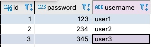
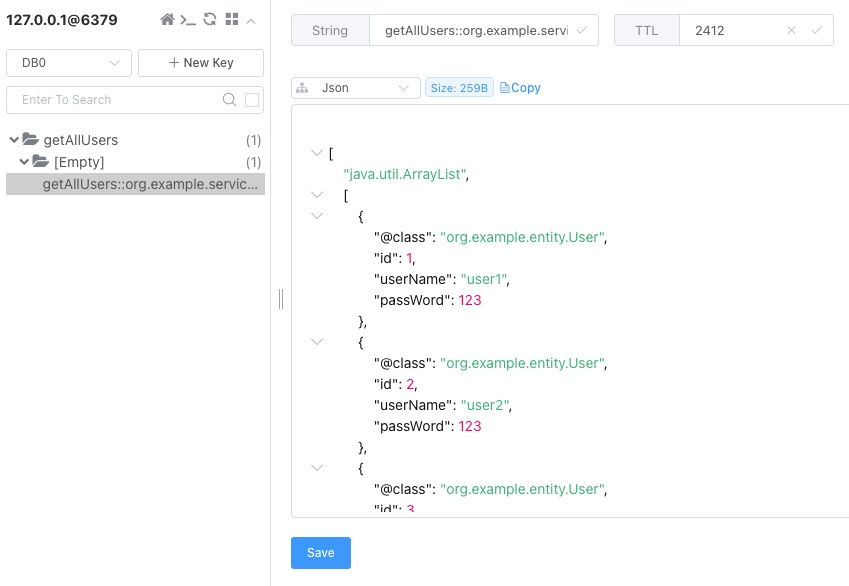

An example application that demonstrates the usage of Redis and Jedis in a user service. It showcases the Spring Cache annotations, Redis configuration, and the Jedis library to provide efficient caching functionality

Prerequisite:
- Redis, MySQL, JDK 17

Steps:

1. Run the application as a Spring Boot application. By configuring spring.jpa.hibernate.ddl-auto=update, the user table will be automatically generated.
2. Manually insert data rows into the user table.  
3. Access the URL:
> http://localhost:8080/users

- On the first request, the console will display the SQL query executed:
  Hibernate: select u1_0.id, u1_0.password, u1_0.username from user u1_0          
  Check Redis:
  The query result is stored in the cache with the key "getAllUsers".
 

- On subsequent requests, the same output is obtained, but there is no SQL query displayed in the console. This indicates that the cache is functioning correctly.

4.Access the URL 
> http://localhost:8080/users/clearAll

This clears the cache. After refreshing Redis, the cache key "getAllUsers" is removed.      

5.The same caching mechanism can be tested for individual users using the endpoint `/users/{id}`. To clear the cache for a specific user, use the endpoint `/users/clear/{id}`.